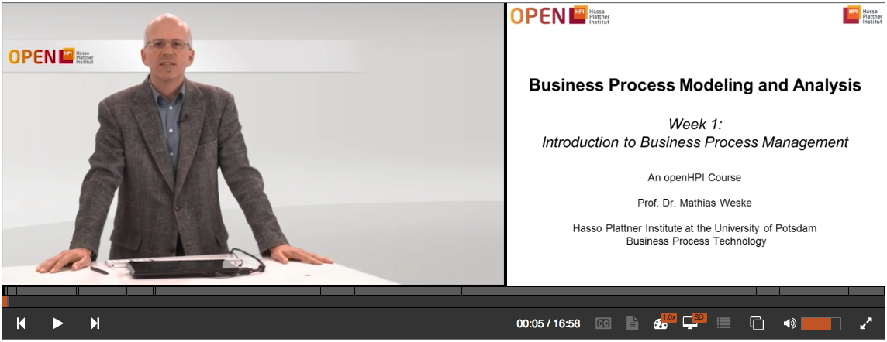
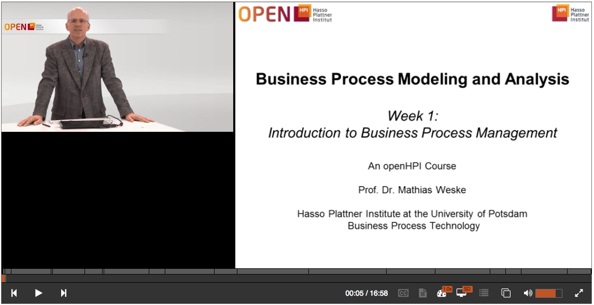
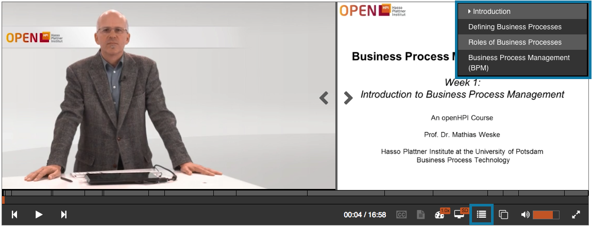
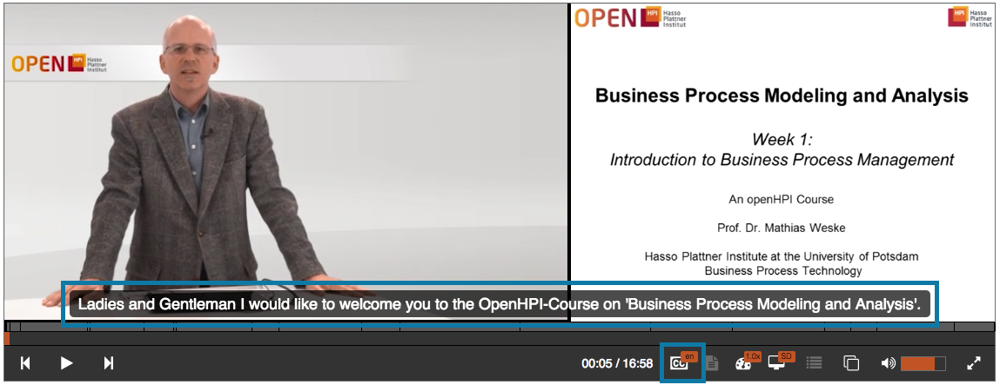
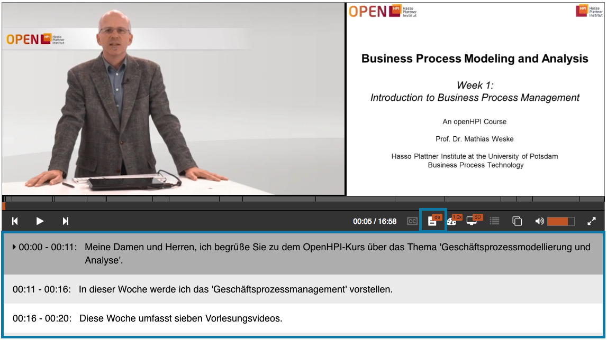
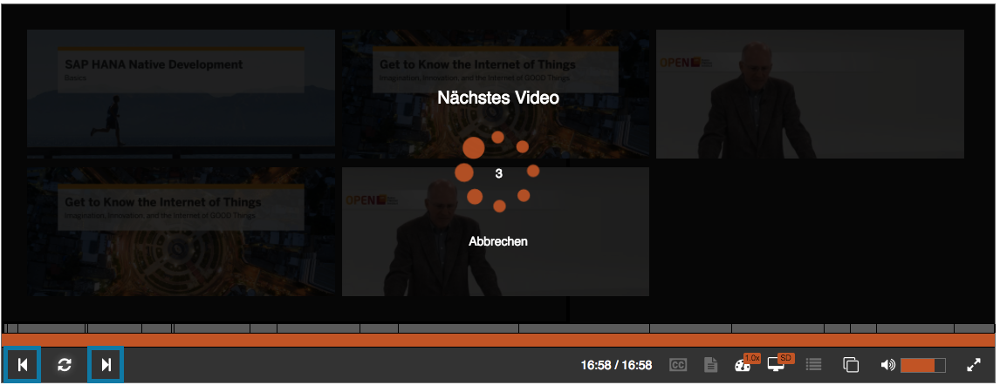
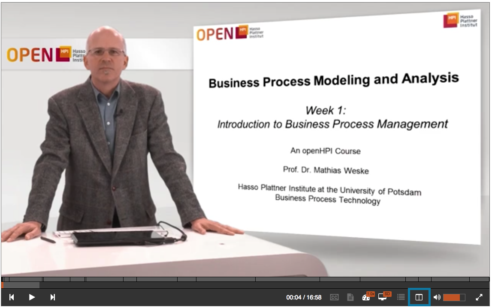
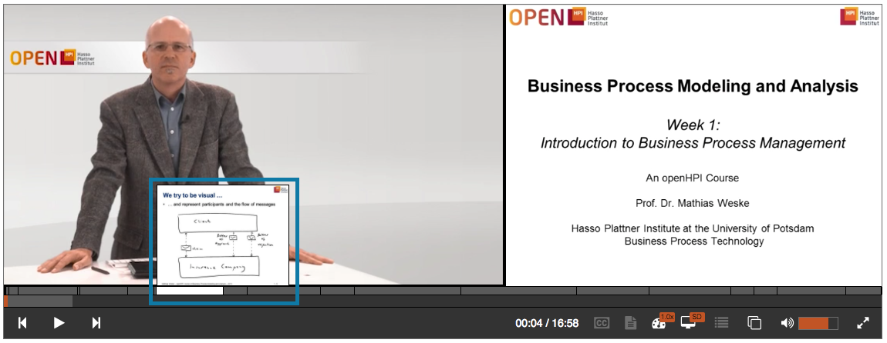
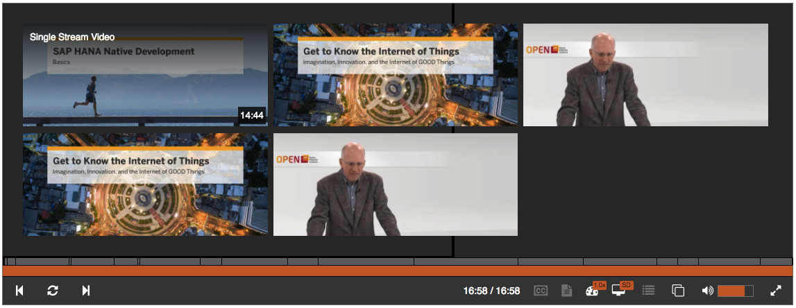
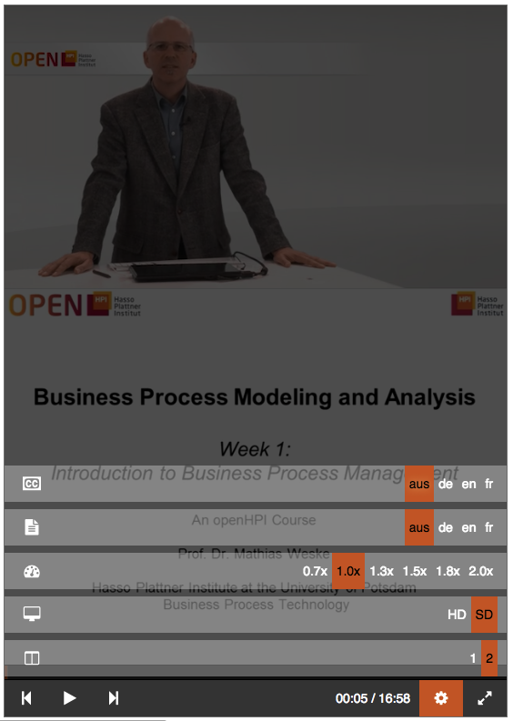

## Features

The videoplayer offers of course basic features each player has:
* Play/Pause
* Mute/Sound control
* Full screen 
* Time display
* Progress bar

These features are not toggable. Next to them there is a set of specialised features which can be turned on and off. For details on how to do that have a look at the [configuration](configuration.md).

### Multi-Stream 
The number of streams to play is not limited. Thereby there are at the maximum two streams next to each other. So when showing more than two the player will be gaining height. On mobile screens the videos are shown below each other of the window orientation is `portrait`.

### Resizer
Between two streams there is a resizer which allows the user to decide which stream should have more space. Per default the videos are aligned to the same height. The resizer can be used via Drag'n'Drop or by clicking on the arrows.

It is hidden on mobile screens.

### Speed control
Via a select control the user can select the playback speed. 

It is part of the control bar.

### Quality control
Via a select control the user can select the quality of the video. Next to for example `SD` and `HD`, `HLS` is supported. Thus the optimal quality is chosen based on the badnwidth. 

It is part of the control bar.

### Chapter list
When a chapter list is given it can be displayed as on overlaying list. By clicking on a certain chapter, the player jumps to the according position. This feature is not available on mobile screens.

It is part of the control bar.

### Captions 
If provided captions can be shown on the video. Via a select control the language can be chosen. 

It is part of the control bar.

### Interactive transcripts
If provided interactive transcripts can be shown below the video. When the video progresses the transcripts scrolls to the according time stamp. When the user clicks on a transcript the video jumps to the according time, too. Via a select control the language can be chosen.
*Note* The language of the captions feature and the interactive transcript depend on each other. When changing one the other will be changed, too. 

This is part of the control bar.

### Playlists

If the video is a part of a given playlist there is the possibility to switch to the next or previous element of this playlist. This can be done with the buttons in the controlbar. Further the next video will be played automatically after the end of the video.

It is part of the control bar.

### Fallback stream
There is the possibility to switch to prerendered picture-in-picture video e.g. when the bandwith is low. 

It is part of the control bar.

### Slide preview
When given there is a slide preview bar on top of the progress bar. There small images of the slides are shown at the according time. When clicking on the slides the player jumps to the time.

### Related video overlay
At the end of the video there is a finished overlay which shows related videos to the videos just seen.

### Mobile menu
Since the is not much space for the control bar on mobile devices there is a special mobile implementation. Thus all features are available for mobile, too.

### Poster images
At the begining there can be poster images shown. They will vanish once the video starts playing.

